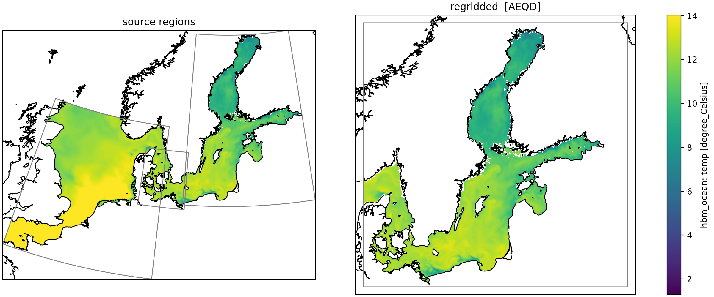

# regrid_ds

Tools to take ocean and weather data (currents, winds, water temperature, bathymetry) from different sources and grids, and put it all onto one common grid, at one common resolution. The result is saved as Zarr files that are ready to feed into a model.



Right now it's built around one data source: the Danish Meteorological Institute's HBM model output for the Baltic Sea. The code is written so a new data source (say, a different ocean model) can be added later without rewriting the shared parts.

## What it does, step by step

1. **Read** — load the raw files (NetCDF or GeoTIFF) for a region.
2. **Regrid** — reproject that region's data onto a shared target grid centered on a chosen point, using proper interpolation (via `xESMF`).
3. **Combine regions** — if a dataset is made of several overlapping regions at different resolutions, stitch them together, with higher-priority regions filling in first.
4. **Fix vector directions** — for data like currents and winds, rotate the north/east components so they point correctly on the new grid.
5. **Write** — save the result to a Zarr store, appending new time steps as they come in. If a run gets interrupted, it picks up where it left off instead of starting over.
6. **Validate** — optionally re-check a finished dataset against the config, without needing the original source files.

There's also a small script to plot a "before and after" map for a single timestamp, so you can sanity-check that the regridding looks right.

## Setup

`xesmf` (the regridding library) needs ESMF, which isn't reliably installable via pip on Windows. So:

```bash
conda env create -f environment.yml   # recommended, includes xesmf/esmf
```

or, if you don't need regridding (e.g. just running tests unrelated to it):

```bash
uv sync
uv pip install -e ".[dev]"
```

Copy `.env.example` to `.env` and fill in:
- `LOCAL_DIR` — where the source data lives on disk
- `FTP_HOST`, `FTP_USERNAME`, `FTP_PASS`, `REMOTE_DIR` — only needed if you're downloading source data yourself

## Running it

The pipeline is configured with [Hydra](https://hydra.cc), so you pick a dataset and a region ("domain") on the command line:

```bash
python run.py                                        # defaults: hbm_ocean data, Baltic Sea region
python run.py dataset=hbm_forcing domain=baltic_sea
python run.py dataset=hbm_bathymetry mode=dry_run     # just print a summary, don't write anything
python run.py dataset=hbm_forcing mode=check          # check an already-saved dataset is valid
```

To pull down source data from the FTP server first:

```bash
python -m lftp_downloader -f extract_2013-2025_currents,winds_extract
```

(Don't `import lftp_downloader` from a script or shell — it kicks off a real FTP transfer as soon as it's imported. Always run it as a module or script.)

To generate a quick before/after plot for one dataset:

```bash
python domain_vis.py dataset=hbm_ocean
```

## Testing

```bash
pytest
ruff check .
```

## Layout

- `src/grid_interp.py` — builds the target grid and does the actual regridding + vector rotation. Not tied to HBM specifically.
- `src/io_functions.py` — reading source files and writing the Zarr output store. Also not HBM-specific.
- `src/validate.py` — read-only checks against a finished dataset.
- `src/hbm_regridder.py` — glues the above together for the HBM data source (file queues, checkpointing, the main pipeline loop).
- `src/lftp_downloader.py` — mirrors source data from DMI's FTP server.
- `configs/` — Hydra configs: `dataset/` (what to read) and `domain/` (where/when — grid, region, time range).
- `run.py` — CLI entry point.
- `domain_vis.py` — before/after visualization for one sample timestamp.

## License

MIT — see [LICENSE](LICENSE).
