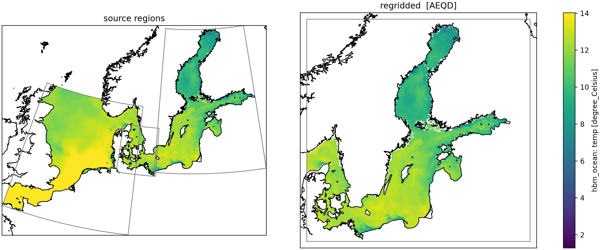

# regrid_ds

Tools to take ocean and weather data (currents, winds, water temperature, bathymetry) from different sources and grids, and put it all onto one common azimuthal equidistant grid, at one common resolution. The result is saved as Zarr files for training ocean dynamic neural operators.



The domain window can be repositioned by changing the center location (lat_0, lon_0) in the domain config.

## What it does, step by step

1. **Read** — load the raw files (NetCDF or GeoTIFF) for a region.
2. **Regrid** — reproject that region's data onto a shared target grid centered on a chosen point, using proper interpolation (via `xESMF`).
3. **Combine regions** — if a dataset is made of several overlapping regions at different resolutions, stitch them together, with higher-priority regions filling in first.
4. **Fix vector directions** — for data like currents and winds, rotate the north/east components so they point correctly on the new grid.
5. **Write** — save the result to a Zarr store, appending new time steps as they come in. If a run gets interrupted, it picks up where it left off instead of starting over.
6. **Validate** — optionally re-check a finished dataset against the config, without needing the original source files.

There's also a small script to plot a "before and after" map for a single timestamp, so you can sanity-check that the regridding looks right.

## Setup

`xesmf` (the regridding library) needs ESMF, which isn't reliably installable via pip on Windows. So:

```bash
conda env create -f environment.yml   # recommended, includes xesmf/esmf
```

## Running it

The pipeline is configured with Hydra, so you pick a dataset and a region ("domain") on the command line:

```bash
python run.py                                        # defaults: hbm_ocean data, Baltic Sea region
python run.py -m dataset=hbm_ocean,hbm_forcing,hbm_bathymetry domain=baltic_sea
python run.py dataset=hbm_bathymetry mode=dry_run     # just print a summary, don't write anything
python run.py dataset=hbm_forcing mode=check          # check an already-saved dataset is valid
python run.py dataset=nemo_ocean domain=nordic_seas
python run.py dataset=nemo_forcing domain=nordic_seas
python run.py dataset=hbm_ocean mode=rechunk          # convert a saved store to the configured chunk/shard layout
```

Zarr layout is set per domain: `time_chunk` (hours per chunk) and `time_shard` (hours per file on disk, a multiple of `time_chunk`).

To generate a quick before/after plot for one dataset:

```bash
python domain_vis.py dataset=hbm_ocean
```

## Layout

- `src/grid_interp.py` — builds the target grid and does the actual regridding + vector rotation. Not tied to HBM specifically.
- `src/readers.py` — reading source files (plain NetCDF, GeoTIFF). Dataset-agnostic.
- `src/writers.py` — writing the Zarr output store / static `.npz` files. Also dataset-agnostic.
- `src/output_validation.py` — read-only checks against a finished dataset.
- `src/rechunk.py` — rewrites a saved Zarr store with the current chunk/shard layout (`mode=rechunk`).
- `src/regridder.py` — dataset-agnostic file queues, checkpointing, and the main read -> regrid -> write pipeline loop. Source-specific reading (HBM, NEMO, ...) lives in `dataset.reader_fn`.
- `src/nemo_reader.py` — NEMO curvilinear-grid reader: colocates `ssh`/`ubar`/`vbar` onto a common T-point grid and unrotates `ubar`/`vbar` from grid-relative to true east/north before regridding.
- `configs/` — Hydra configs: `dataset/` (what to read) and `domain/` (where/when — grid, region, time range).
- `run.py` — CLI entry point.
- `domain_vis.py` — before/after visualization for one sample timestamp.

## License

MIT — see [LICENSE](LICENSE).
